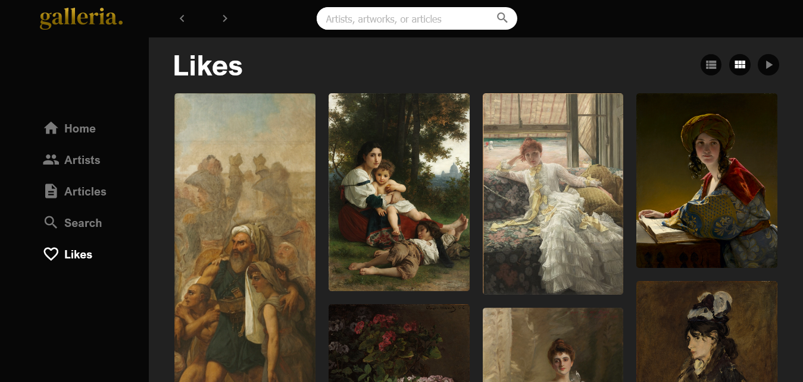

# Galleria - Online art gallery.

## Table of contents

- [Overview](#overview)
  - [Screenshot](#screenshot)
  - [Links](#links)
- [My process](#my-process)
  - [Built with](#built-with)
  - [Useful resources](#useful-resources)
- [Author](#author)

## Overview

### Screenshot

### Links

- Live Site URL: [Galleria](https://galleria-arts.netlify.app/)

## My process

### Built with

- [React.JS](https://reactjs.org/)
- Sass
- Flexbox
- CSS Grid
- Mobile-first workflow

### Useful resources

- [Art Institute of Chicago API](https://api.artic.edu/docs/)
- [The Cleveland Museum of Art Open Access API](https://openaccess-api.clevelandart.org/)

## Author

- Email - [Shaher Ashraf](shaherashraf77@gmail.com)
